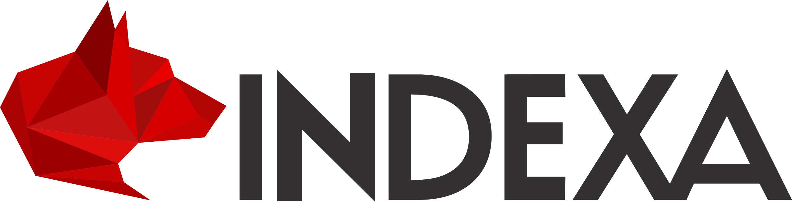

<h1 align="center">
  <a href="https://www.indexa.sh">
    <picture>
      <source media="(prefers-color-scheme: dark)" srcset="./assets/indexa-dark.png">
      <source media="(prefers-color-scheme: light)" srcset="./assets/indexa-light.png">
      
    </picture>
  </a>
</h1>

  <strong lang="es">Software que entiende tu negocio</strong> 
  Digital products, platforms, and software built around the business and the people who use them

## About INDEXA

We design and build digital products of our own and for clients. We connect product decisions, customer experience, and engineering so the systems behind each product can support its use and growth.

## What we build

- Digital products from the first important decision to production
- Experiences that make complex operations easier to understand
- Platforms, APIs, integrations, and software that fit existing systems
- Engineering foundations for products that need to grow

## Products and experience

- **Timbro**  
  An INDEXA product connecting commerce, payments, and electronic invoicing
- **Fixcal**  
  An electronic invoicing product and implementation developed by INDEXA
- **Cuenta Única**  
  Team experience in product, design, engineering, DevOps, and production for a product owned and operated by OGTIC

## Start a conversation

Have a product to create, an experience to improve, a platform to integrate, or a system that needs to grow?

[Visit indexa.sh](https://www.indexa.sh) · [Email INDEXA](mailto:hello@indexa.do)
